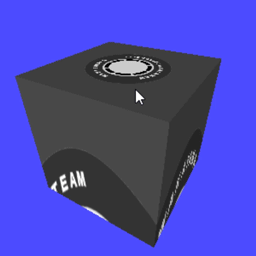

# texture2: テクスチャ:第６回 投影マッピング サンプルプログラム

## 1. 概要

このプログラムは、OpenGL における「テクスチャマッピング (Texture Mapping)」の基礎を学ぶための、学生向けのサンプルプログラムです。本プログラムは、以下のブログ記事の解説に沿って学習を進めるための雛形として提供されています。

- [テクスチャ第６回：投影マッピング](https://tokoik.github.io/blog/opengl/%E3%83%86%E3%82%AF%E3%82%B9%E3%83%81%E3%83%A3/2004/09/20/texture.html)

今回は通常のテクスチャマッピングとは少し異なり、スライドプロジェクターやスポットライトで物体に画像を投影するようにマッピングする、**テクスチャ投影 (Projective Texture Mapping)** という手法を実装します。プログラムを実行すると、テクスチャが立方体に投影されながらアニメーションする様子を観察できます。

<div style="text-align: center;">

</div>

## 2. ビルド方法

このプログラムは CMake を用いてビルドを構成しています。各プラットフォームごとの手順は以下の通りです。なお、プログラムをビルドするためのバイナリディレクトリは、バージョン管理ファイル（.gitignore）の設定に合わせて build という名前にします。

### 2.1 Windows (Visual Studio 2022 の場合)

1. コマンドプロンプトまたは PowerShell を開き、このプロジェクトのディレクトリに移動します。

2. 以下のコマンドを実行してビルドディレクトリを作成し、CMake で構成を行います。

```bat
mkdir build
cd build
cmake .. -G "Visual Studio 17 2022"
```

3. 生成された build フォルダ内の texture2.sln を Visual Studio で開きます。

4. ソリューションエクスプローラーで texture2 プロジェクトを右クリックし、「スタートアップ プロジェクトに設定」を選択します。

5. 「ローカル Windows デバッガー」をクリックするか、F5 キーを押してビルドおよび実行します。

### 2.2 macOS (Xcode の場合)

1. ターミナルを開き、このプロジェクトのディレクトリに移動します。

2. 以下のコマンドを実行してビルドディレクトリを作成し、Xcode 用のプロジェクトを生成します。

```sh
mkdir build
cd build
cmake .. -G Xcode
```

3. 生成された build/texture2.xcodeproj を Xcode で開きます。

4. 左上のスキーム選択（再生ボタンの横）が texture2 になっていることを確認します。

5. 「Run」ボタン（再生ボタン）をクリックするか、Command + R を押してビルドおよび実行します。

### 2.3 Ubuntu Linux

1. ターミナルを開き、このプロジェクトのディレクトリに移動します。

2. 必要なパッケージ（freeglut3-dev や pkg-config など）がインストールされていることを確認し、以下のコマンドでビルドします。

```sh
mkdir build
cd build
cmake ..
make
```

## 3. 使い方

### 3.1 プログラムの起動方法

各OSとも、ビルド後に生成されるバイナリディレクトリ (build) やそのサブフォルダから起動します。（※ CMake の設定により、Windows や Xcode では Debug などのフォルダ下に実行ファイルが置かれることがあります）

- **Windows**

Visual Studio 上で「ローカル Windows デバッガー」をクリックして実行するか、またはコマンドプロンプトから以下のコマンドで起動します。

```cmd
cd build\Debug
texture2.exe
```

- **macOS**

Xcode 上で左上の「Run（再生ボタン）」をクリックするのが楽です。これにより texture2.app アプリケーションバンドルとして自動的に実行されます。アプリケーションバンドルを直接起動するなら、Finder から build/Debug/texture2.app をダブルクリックするか、ターミナルから open build/Debug/texture2.app を実行します (この場合はエラーメッセージ等が表示されません)。

- **Ubuntu Linux**

ターミナルから以下のコマンドで実行ファイル（バイナリ）を直接起動します。

```sh
cd build
./texture2
```

### 3.2 操作方法

- **マウスの左ボタンでドラッグ**: 画面内のオブジェクト（または投影されるテクスチャ）を３次元的に回転させることができます。

- **キーボードの q, Q または ESC キー**: プログラムを終了します。

## 4. 解説

このプログラムは、画像を 3D 空間の物体に投影して貼り付ける処理を行っています。プログラムの主要な処理手順とアルゴリズムは以下の通りです。

### 4.1 テクスチャ画像の読み込みと設定 (`init()` 関数)

- プログラム起動時、`init()` 関数内で RAW 形式の画像ファイル（`tire.raw`）を読み込み、配列に格納します。

- 読み込んだ画像データを [`glTexImage2D()`](https://registry.khronos.org/OpenGL-Refpages/gl2.1/xhtml/glTexImage2D.xml) 関数を使って OpenGL のシステム（GPU）に転送します。

- [`glTexParameteri()`](https://registry.khronos.org/OpenGL-Refpages/gl2.1/xhtml/glTexParameter.xml) を使って、画像を引き伸ばしたときの補間方法（滑らかにする処理）や、画像の端の扱い方（`GL_CLAMP_TO_EDGE`：端の色を延長する）を設定します。

### 4.2 テクスチャ座標としての 3D 頂点座標の利用 (`box.cpp`)

- 通常のテクスチャマッピングでは、画像の縦横を `0.0` から `1.0` までの 2D 座標（U, V 座標）で指定します。

- しかし、このプログラムの `box()` 関数では、[`glTexCoord3dv()`](https://registry.khronos.org/OpenGL-Refpages/gl2.1/xhtml/glTexCoord.xml) という関数を使い、物体の頂点の 3D 座標（X, Y, Z）をそのままテクスチャ座標として割り当てています。

- この段階ではまだ画像は正しく貼り付けられず、3D 空間の座標系とテクスチャの座標系が直接結びついた状態になります。

### 4.3 テクスチャ行列によるプロジェクターのシミュレーション (`display` 関数)

- `display()` 関数内で [`glMatrixMode(GL_TEXTURE)`](https://registry.khronos.org/OpenGL-Refpages/gl2.1/xhtml/glMatrixMode.xml) を呼び出し、「テクスチャ行列」を操作するモードに切り替えます。テクスチャ行列を使うと、指定したテクスチャ座標に対して移動や回転などの変換をかけることができます。

- ここで、カメラの位置を決める [`gluLookAt()`](https://registry.khronos.org/OpenGL-Refpages/gl2.1/xhtml/gluLookAt.xml) と、遠近感を計算する透視投影の [`gluPerspective()`](https://registry.khronos.org/OpenGL-Refpages/gl2.1/xhtml/gluPerspective.xml) を呼び出します。これにより、「仮想的なプロジェクター」を 3D 空間に配置し、そこから画像を投影する計算が行われます。

- 投影計算の結果として得られる座標は -1.0 から 1.0 の範囲になりますが、テクスチャ画像は 0.0 から 1.0 の範囲で扱う必要があるため、[`glScaled(0.5, 0.5, 1.0)`](https://registry.khronos.org/OpenGL-Refpages/gl2.1/xhtml/glScale.xml) と [`glTranslated(0.5, 0.5, 0.0)`](https://registry.khronos.org/OpenGL-Refpages/gl2.1/xhtml/glTranslate.xml) を使って座標の範囲を半分に縮小し、ずらす処理を行っています。

- さらに時間経過 (`t`) に応じた [`glRotated()`](https://registry.khronos.org/OpenGL-Refpages/gl2.1/xhtml/glRotate.xml) による回転を加えることで、投影される画像が回転アニメーションするようになります。

### 4.4 モデルビュー行列の切り替えと描画 (`display` 関数)
   
- テクスチャの設定が終わったら、[`glMatrixMode(GL_MODELVIEW)`](https://registry.khronos.org/OpenGL-Refpages/gl2.1/xhtml/glMatrixMode.xml) を呼び出して、通常の物体を描画するための行列モードに戻します。

- [`gluLookAt()`](https://registry.khronos.org/OpenGL-Refpages/gl2.1/xhtml/gluLookAt.xml) で画面を見る実際のカメラ（視点）を設定し、`scene()` 関数を呼び出して物体（箱）を描画します。

- この結果、4.3 で設定された「テクスチャプロジェクター」から投影された模様が、箱の表面に浮かび上がって画面に表示されます。
